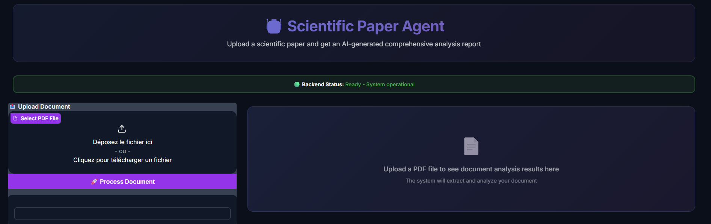

# Backbone

Dynamic Summarization of Scientific Papers Using Profile-Aware AI 

Context:

In my current position at EURANOVA, I give a weekly presentation to all my colleagues on the latest developments in AI around the world, covering news, tools, scientific papers, and more. I scan the internet to identify trending events and hot topics related to AI and ML globally.

One section of the presentation is dedicated to scientific papers, where I summarize a recent advancement in the field. These summaries need to be brief and high-level because the audience is cross-functional—many colleagues do not have a deep technical background. Therefore, the presentation must be adapted to be easily understood by everyone.

Preparing this section typically takes me over an hour, as I read the paper, understand the underlying methods, evaluate the achievements, and consider how it could be relevant to the internal projects we are working on. To streamline this process, I decided to create an agent that can help me prepare the presentation by extracting highlights and key insights that I can directly use in my talk.




*Example of the Backbone interface showing PDF upload, processing, and content extraction*

## Architecture

This application is split into two separate services:

- **Frontend**: Gradio-based web interface (port 7860)
- **Backend**: FastAPI document processor service (port 8000)

The frontend automatically waits for the backend to be healthy before starting, ensuring users cannot make requests until the backend is ready.

## Prerequisites

- Docker and Docker Compose installed on your system
- Git (to clone the repository)

## Quick Start with Docker Compose

The easiest way to run the application is using Docker Compose:

```bash
docker-compose up --build
```

This will:
- Build both the frontend and backend services
- Start the backend service first and wait for it to be healthy
- Start the frontend service only after the backend is ready
- Make the application available at http://localhost:7860

### Running Individual Services

To run only the backend:
```bash
docker-compose up backend
```

To run only the frontend:
```bash
docker-compose up frontend
```

## Accessing the Application

Once running, you can access:
- **Frontend (Gradio UI)**: http://localhost:7860
- **Backend API**: http://localhost:8000
- **API Documentation (Swagger UI)**: http://localhost:8000/docs
- **API Documentation (ReDoc)**: http://localhost:8000/redoc
- **Health Check**: http://localhost:8000/health

## API Endpoints

The document processor provides the following endpoints:

### Health Check
- `GET /health` - Health check endpoint to verify the API is running
  - Returns: `{"status": "healthy", "service": "document_processor"}`

### PDF Processing
- `POST /process_pdf_file` - Process a PDF file and extract its content using unstructured
  - **Request**: Multipart form data with a PDF file
  - **Response**: 
    ```json
    {
      "status": "success",
      "content": "extracted text content...",
      "num_elements": 42,
      "file_size_mb": 1.23
    }
    ```

## Project Structure

```
├── document_processor.py      # FastAPI backend service
├── interface.py               # Gradio frontend interface
├── requirements.backend.txt   # Backend Python dependencies
├── requirements.frentend.txt  # Frontend Python dependencies
├── Dockerfile.backend         # Backend container definition
├── Dockerfile.frontend        # Frontend container definition
├── docker-compose.yml         # Multi-service setup
├── uploads/                   # File upload directory (mounted volume)
├── logs/                      # Application logs (mounted volume)
└── README.md
```

## Features

### Backend Service
- FastAPI-based REST API
- PDF processing using `unstructured` library
- Automatic text extraction from PDF documents
- Health check endpoint for service monitoring
- Comprehensive logging to `logs/document_processor.log`
- Temporary file cleanup after processing

### Frontend Service
- Gradio-based user interface
- PDF file upload and processing
- Real-time backend status indicator
- Automatic backend health checking
- Disabled UI until backend is ready
- Displays extracted content, element count, file size, and processing status

## Service Dependencies

The frontend service is configured to:
1. Wait for the backend to pass its health check before starting (via `depends_on` in docker-compose)
2. Perform additional health checks at startup (waits up to 60 seconds)
3. Disable UI components until backend is confirmed ready
4. Check backend health before processing each request

## Development

### Running Locally (without Docker)

#### Backend
```bash
pip install -r requirements.backend.txt
uvicorn document_processor:app --host 0.0.0.0 --port 8000 --reload
```

#### Frontend
```bash
pip install -r requirements.frentend.txt
python interface.py
```

### Environment Variables

The frontend uses the following environment variable:
- `BACKEND_URL`: URL of the backend service (default: `http://backbone-backend:8000`)

Set this in docker-compose.yml or create a `.env` file.

### Logs

Backend logs are written to `logs/document_processor.log` with:
- Rotation: 100 MB per file
- Retention: 10 days
- Format: `{time} {level} {message}`
- Level: INFO

## Troubleshooting

### Backend not starting
- Check logs: `docker-compose logs backend`
- Verify health endpoint: `curl http://localhost:8000/health`
- Ensure port 8000 is not already in use

### Frontend not starting
- Check if backend is healthy first
- Check logs: `docker-compose logs frontend`
- Verify `BACKEND_URL` environment variable is set correctly

### PDF processing fails
- Ensure the uploaded file is a valid PDF
- Check backend logs for detailed error messages
- Verify unstructured library dependencies are installed correctly

## Debugging

To debug a container, you can access it with:

```bash
# Frontend container
docker exec -it backbone-frontend /bin/bash

# Backend container
docker exec -it backbone-backend /bin/bash
```

## License

See LICENSE file for details.
