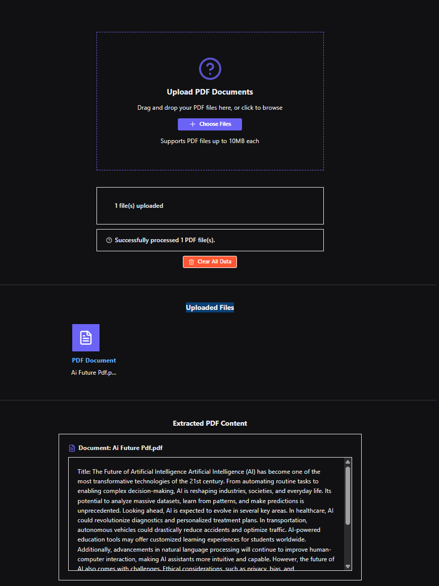

# Backbone

Dynamic Summarization of Scientific Papers Using Profile-Aware AI 

## Screenshot



*Example of the Backbone interface showing PDF upload, processing, and content extraction*

## Architecture

This application is now split into two separate services:

- **Frontend**: Reflex-based web interface (port 3000)
- **Document Processor**: FastAPI backend service (port 8000)

## Prerequisites

- Docker and Docker Compose installed on your system
- Git (to clone the repository)

## Quick Start with Docker Compose

The easiest way to run the application is using Docker Compose:

```bash
docker-compose up --build
```

This will:
- Build both the frontend and document processor services
- Start both services with proper networking
- Make the application available at http://localhost:3000

## Manual Setup

### Option 1: Using the Startup Script

```bash
chmod +x start.sh
./start.sh
```

### Option 2: Running Services Separately

#### Start the Document Processor (Backend)
```bash
cd document_processor
pip install -r requirements.txt
python -m uvicorn main:app --host 0.0.0.0 --port 8000 --reload
```

#### Start the Frontend
```bash
pip install -r requirements.txt
reflex run --frontend-port 3000
```

## Accessing the Application

Once running, you can access:
- **Frontend**: http://localhost:3000
- **Document Processor API**: http://localhost:8000
- **API Documentation**: http://localhost:8000/docs

## Project Structure

```
├── backbone/                 # Frontend (Reflex app)
│   ├── __init__.py
│   └── backbone.py          # Main frontend code
├── document_processor/       # Backend (FastAPI)
│   ├── __init__.py
│   ├── main.py             # API endpoints
│   ├── requirements.txt    # Backend dependencies
│   └── Dockerfile          # Backend container
├── uploads/                 # File upload directory
├── requirements.txt         # Frontend dependencies
├── Dockerfile              # Frontend container
├── docker-compose.yml      # Multi-service setup
├── start.sh               # Development startup script
└── README.md
```

## API Endpoints

The document processor provides the following endpoints:

- `POST /upload` - Upload PDF files
- `POST /process-pdfs` - Process uploaded PDFs and extract text
- `GET /files` - List uploaded files
- `DELETE /files` - Delete uploaded files
- `GET /health` - Health check

## Development

The application is designed for easy development with hot reloading enabled for both services. Changes to the code will automatically restart the respective services.

```bash
reflex run --backend-host 0.0.0.0 --backend-port 8000 --frontend-port 3000
```